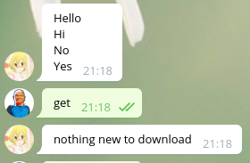

# tsbot

it's a bot



Local testing:

```
PATH=$(pwd):$PATH cargo run
```

## Env requirements

```
TELEGRAM_BOT_TOKEN=some telegram bot token
TELEGRAM_BOT_MASTER=your user id
```

## Env requirements

```
scraper (executable in PATH)
```
